<div align="center">

<picture>
  <source media="(prefers-color-scheme: dark)" srcset="assets/header.svg">
  
</picture>

<br/>

<a href="https://linkedin.com/in/ahbibe"></a> <a href="mailto:boubkerahbibe@gmail.com"></a>  

</div>

<br/>

<table width="100%">
<tr>
<td width="52%" valign="top">

```console
$ whoami --verbose

  name      Boubker Ahbibe
  location  Morocco
  role      Software Engineer
  doing     backend services and
            platform infrastructure
  learning  Active Directory,
            red teaming, web app security

$ uptime

  writing C since 2018,
  still enjoy segfaults
```

</td>
<td width="48%" valign="top">

**languages**


**backend and data**


**infrastructure**


**offensive security**

`nmap` &nbsp;`Burp Suite` &nbsp;`BloodHound` &nbsp;`Wireshark` &nbsp;`Metasploit`

</td>
</tr>
</table>

## selected work

<table width="100%">
<tr>
<td width="33%" valign="top">

### [webserv](https://github.com/bahbibe/webserv)

 

HTTP/1.1 and HTTPS server on a single-threaded `epoll` loop. Non-blocking CGI pipes, uploads, TLS termination, nginx-style config parser.

</td>
<td width="33%" valign="top">

### [ft_onion](https://github.com/bahbibe/ft_onion)

 

A site and an SSH endpoint reachable only as a hidden service. No published host ports, nothing exposed on the host at all.

</td>
<td width="33%" valign="top">

### [ft_otp](https://github.com/bahbibe/ft_otp)

 

TOTP generator. Keys sealed with AES-256-GCM at rest, QR provisioning, small web UI with a live countdown.

</td>
</tr>
<tr>
<td valign="top">

### [arachnida](https://github.com/bahbibe/arachnida)

 

Recursive image crawler, plus a metadata inspector with a terminal UI for reading, editing and stripping EXIF tags.

</td>
<td valign="top">

### [inception](https://github.com/bahbibe/inception)

 

Nginx, WordPress and MariaDB, each in a container built from a hand-written Dockerfile. No prebuilt images, no shortcuts.

</td>
<td valign="top">

### [minishell](https://github.com/bahbibe/minishell)

 

A bash-like shell: lexer, parser, pipes, redirections, heredocs, signal handling and builtins, written from scratch.

</td>
</tr>
</table>

## currently

```diff
+ Active Directory attack paths, GOAD lab
+ web application security and exploit write-ups
+ network and systems programming in C and Go
+ infrastructure automation across a campus fleet
```

<div align="center">
<br/>
<sub><code>secure by design, curious by nature</code></sub>
</div>
